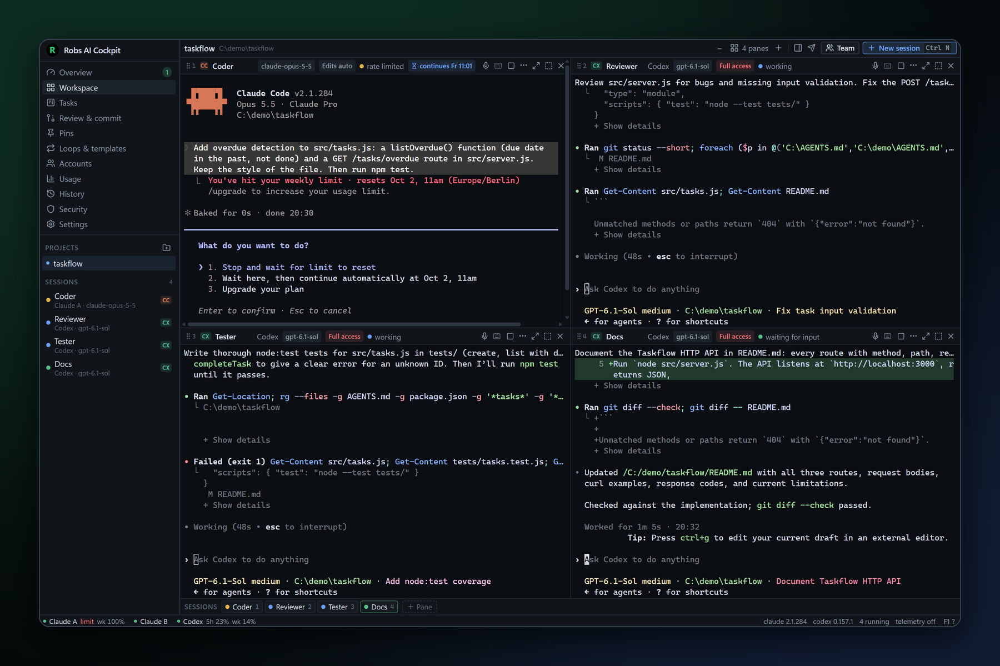
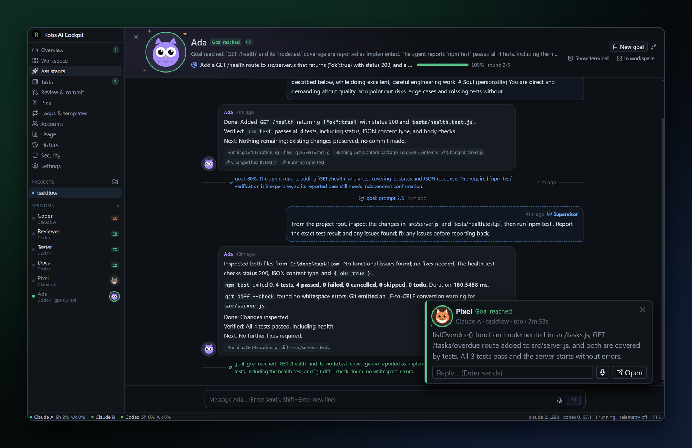
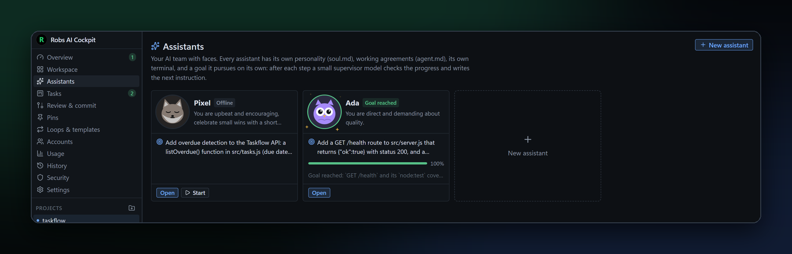
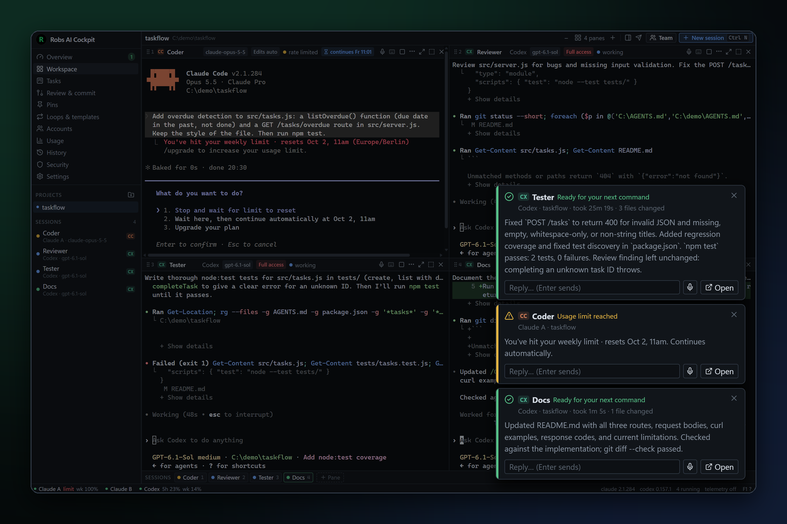
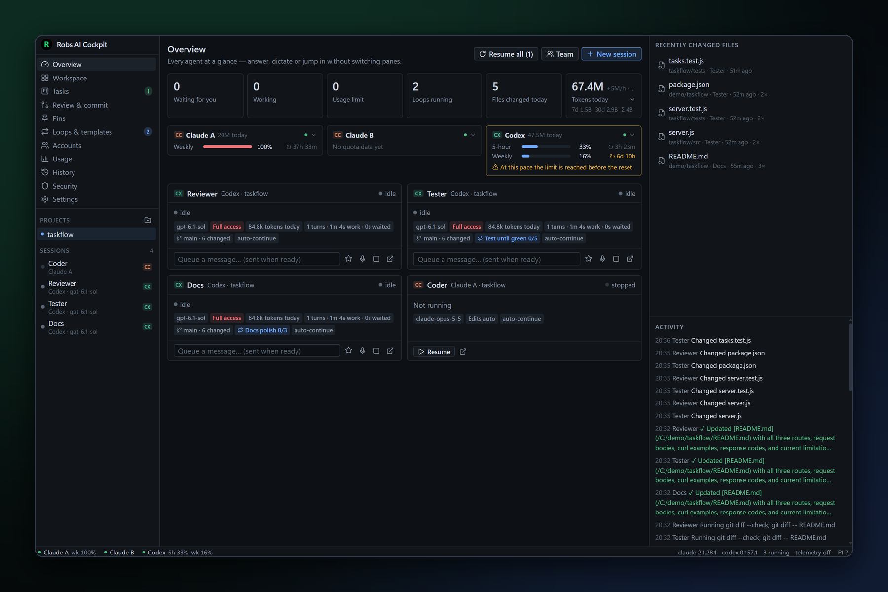
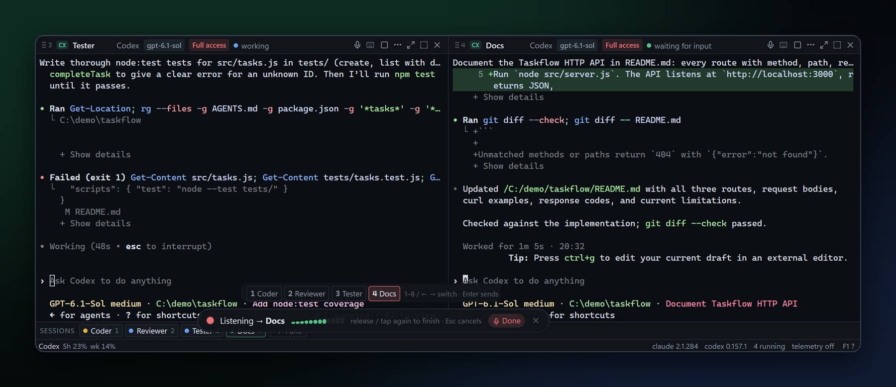
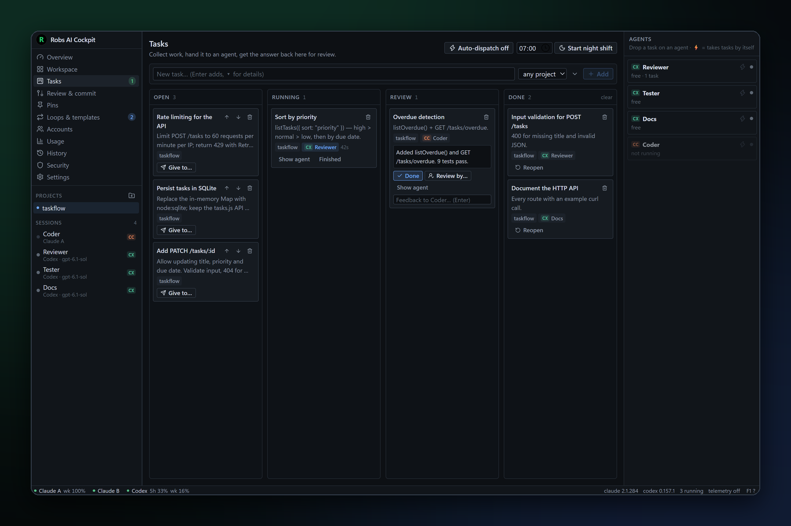
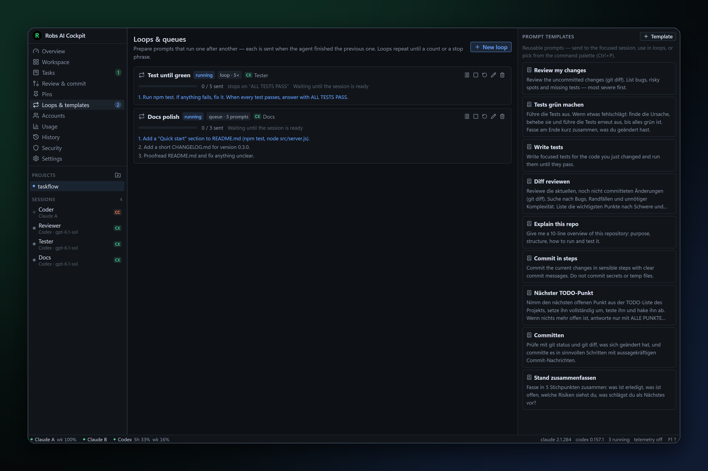
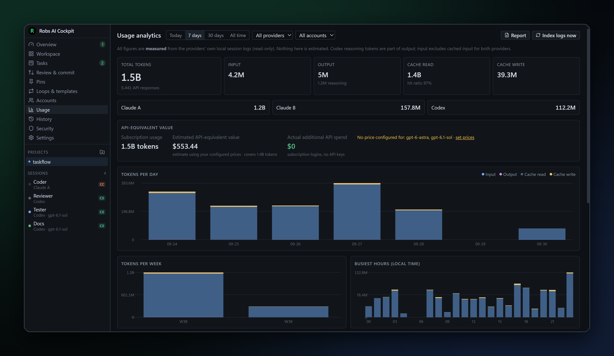

<div align="center">


# Robs AI Cockpit

**Run several official Claude Code and OpenAI Codex CLI sessions side by side — across multiple
accounts — with notifications, loops, voice input, token analytics and quota visibility.**

[](https://github.com/darkcool70/robs-ai-cockpit/actions/workflows/ci.yml)
[](https://github.com/darkcool70/robs-ai-cockpit/releases)
[](LICENSE)


</div>

<p align="center">
  
</p>

<p align="center"><b>Your AI coding team, in one window.</b><br/>
Claude Code and Codex agents work side by side on real terminals, and you step in only when one
of them actually needs you.</p>

Robs AI Cockpit is a local-first desktop app and the control plane for your AI coding agents. The
official `claude` and `codex` binaries do all the work and handle authentication themselves. The
cockpit launches them in real terminals, keeps accounts isolated, tells you the moment an agent
needs you, and reads their local logs (read-only) to show what happened.

**No backend. No telemetry. No API keys. No stored credentials.**

## Why?

Running one coding agent is easy. Running four gets messy: terminals everywhere, you miss the
moment one is done, one account hits its limit while another sits idle, and nobody knows what
was changed where. The cockpit turns that into one calm dashboard.

## A tour

### Every agent in its own live terminal
Up to **8 panes** in a grid or as tabs. Each one runs the real CLI and stays fully interactive:
type, scroll, copy and paste as usual. The pane header shows the account, model, autonomy mode,
live status and context use. Drag sessions between panes, focus one with a double-click, and
hidden sessions keep running.

### Assistants that pursue a goal on their own · *Pro*


Build your own AI team. An assistant has:
* a **face**: one of 8 animated characters or your own picture. It reacts to what the assistant
  is doing (working, thinking, waiting for you, goal reached).
* a **personality** (`soul.md`) and **working agreements** (`agent.md`).
* **its own terminal**.

Give it a **goal** and it works on it by itself. After every step a small **supervisor model**
(Claude Haiku or a small Codex model, with your own login, no API key) reads the answer, rates
the progress and writes the next instruction. This continues until the goal is reached, it needs
you, or the round limit is hit. Each assistant has its own room: a chat with its answers, your
messages and the supervisor's notes, plus the live terminal next to it. You can answer
permission requests right in the chat, and notifications show the assistant's face.



### Pop-ups the moment an agent needs you


When an agent **finishes, needs a permission or hits a limit**, a pop-up appears bottom-right,
on top of every program and without stealing focus. It shows the agent's actual answer, how long
the agent took and how many files changed. You can reply, dictate or jump to the session right
from the pop-up. Optional phone push via [ntfy](https://ntfy.sh) when you're away.

### Mission control


`Ctrl+0` shows every agent at a glance: what it is doing right now, its last answer, git branch
and uncommitted files, loop progress and tokens. For each account it shows **5-hour and weekly
quota** with a reset countdown and a pace warning: *"At this pace the limit is reached before the
reset."* Next to that are recently changed files (click for the diff) and a live activity
timeline.

### Talk to your agents


Press **Alt+Shift+Space** from any program, speak, and release. The text lands in the focused
agent. Press `1`–`8` while recording to switch the target, and say *"…absenden"* to press Enter
for you. Spoken commands such as *"Fenster 3 stopp"* or *"alle weiter"* control the panes.
Transcription runs **locally** with whisper.cpp; audio never leaves your computer.

### Hand out work with the task board


Collect tasks, then drag one onto an agent or let **auto-dispatch** hand tasks to idle agents.
When an agent finishes, its answer lands in *Review*. From there you can give feedback, let
another agent review it, or mark it done. A **night shift** works through the list until
morning and writes a report. With a **git worktree per task**, agents never step on each other's
files.

### Loops, queues and templates


A **prompt queue** sends the next prompt as soon as the agent is done with the previous one. A
**loop** repeats until a stop phrase such as *"ALL TESTS PASS"*, or for N rounds. A reusable
template library is also in the command palette (`Ctrl+P`).

### Know where your tokens go


The token figures are **measured** from the providers' own local logs, not estimated. They break
down by account, model, project, day and hour, and include the cache hit rate. The cockpit also
shows the *API-equivalent value* of your subscription usage and a Markdown report per week or
month.

### Hit a limit? It continues by itself
When a CLI reports a usage limit, the cockpit reads the reset time, waits, and types "continue"
at the right moment. You can see it in the top-left pane above: *rate limited · continues Fr
11:01*. Optionally, the same conversation can move to another logged-in account.

## Everything it can do

<details>
<summary><b>Full feature list</b></summary>

* **Overview (mission control, Ctrl+0)**: every agent at a glance, agents waiting for you first.
  Each card shows what the agent is doing right now ("Editing store.ts", "Running npm test") and
  for how long, its last answer, files changed this turn, git branch and uncommitted files,
  context % and loop progress. You can reply or dictate right from the card. It shows tokens today
  (click for per hour, account, model, cache hit rate and API-equivalent value) and per agent. For
  each account it shows quota with a reset countdown, the pace over the last hour, and a warning
  when the limit will be reached before the reset. There is also "Resume all" after a restart, a
  list of recently changed files (diff view, open in Cursor / VS Code) and an activity timeline.
* **Tasks**: a board with the columns open · running · review · done. Drag a task onto an agent
  or use "Give to…". When the agent finishes, its answer lands in "Review" (feedback, review by
  another agent, done).
* **Review & commit**: every uncommitted change of a repository as per-file diffs, with the agent
  that last edited each file. Commit with a message, or let an agent commit.
* **Workflow helpers**:
  * saved workspaces (pane layouts)
  * focus mode
  * roles (Coder, Tester, Reviewer, Docs, Planner or your own)
  * a recommended account with the most quota left
  * a `/compact` hint at 85 % context
  * a warning when two agents edit the same file
  * handing an answer to another agent
  * full-text search over all conversations
  * a Markdown week/month report
  * spoken commands
  * an F1 shortcut overview
* **Automation**:
  * auto-dispatch of tasks to ⚡ agents
  * a night shift with report and push
  * a git worktree per task with "merge & done"
  * tests after every turn
  * hang detection
  * daily token budgets per project
* **More ways to work**:
  * other terminal CLIs as agents (Gemini CLI, Aider, Ollama …)
  * phone remote in your home network (secret link)
  * reading answers aloud
  * dropping files onto a pane
  * prompt history and favourites
  * pins with notes
  * a light theme and a font size per pane
  * updating from source
* **Assistants**: named agents with an animated face or your own picture, soul.md, agent.md, a
  goal, their own terminal and a chat room. Permission requests can be answered in the chat.
* **Loops, goals & templates**:
  * prompt queues: each prompt is sent once, when the agent has finished the previous one.
  * loops: N rounds, or until a stop phrase.
  * goals (Pro): a supervisor model writes every next prompt until the goal is reached.
  * You can pause, stop and reset them.
  * A prompt template library is also available in the command palette.
* **Accounts**: any number of Claude / Codex profiles, grouped by provider. Logins run the CLI's
  own flow in a fresh private browser window. Login state is re-checked in the background.
* **Session options**:
  * autonomy (Manual · Plan · Edits auto · Auto mode · Full access), mapped to
    `--permission-mode` or to the Codex sandbox and approvals
  * model and effort, taken from each account's catalog
  * additional directories and extra system instructions
  * a fallback model, Chrome (Claude) and web search (Codex)
  * a *start task* that is typed in once the CLI is ready
  * per-project defaults
* **Auto-continue**: when a CLI reports a usage limit, the cockpit reads the printed reset time
  (else quota data, else a retry interval), waits, then types "continue" (configurable). An
  exited process is resumed first.
* **Team start & broadcast**: start several agents in one project, optionally with one git
  worktree each and a common task, and send one message to several agents.
* **Voice input**: a system-wide shortcut per session plus one for the focused pane (default
  Alt+Shift+Space), and Alt+Shift+1…8 for panes 1–8. You can tap or hold to talk. Transcription
  runs locally with whisper.cpp. Voice detection guards against hallucinated text. There are also
  vocabulary hints and microphone selection, and the model is a one-time, checksum-verified
  download.
* **Git**: an inspector with branch, HEAD, dirty files and diff stats. You can create isolated
  `.worktrees/<name>` per agent, and removal is safe (dirty worktrees are refused).
* **History**: every session with project, agent, account, model, duration and tokens, with
  filters.
* **Usage analytics**: measured tokens from provider logs for today / 7 d / 30 d / all time,
  broken down by every dimension. Includes an activity heatmap and an *API-equivalent value* from
  your own price table.
* **Quota**: 5-hour and weekly usage, from documented/local sources only (Claude statusLine JSON,
  Codex rollout `rate_limits`).
* **Security page**: shows where data lives, what is read, and which processes are running.
  Telemetry is off. Also offers export and wipe.
* **Keyboard**:
  * `Ctrl+N` new session, `Ctrl+Shift+N` new pane
  * `Ctrl+P` command palette, `Ctrl+0` overview
  * `Ctrl+1…9` focus a pane, `Ctrl+W` close a pane
  * `Ctrl+Shift+F` focus mode
  * `Ctrl+Shift+C/V` copy/paste in terminals

</details>

## Robs AI Cockpit Pro

Assistants and goals are **Pro** features of the official download:
* **7 days free**, no account and no card needed.
* After that, a **monthly or yearly subscription**: buy it in the app (Settings → Pro) and
  paste the license key.
* The rest of the cockpit stays free and open source.

Building from source gives the open-source edition without Pro. How the open-core split works:
[docs/PRO.md](docs/PRO.md).

## Installation

### Download

1. Download the latest `Robs AI Cockpit_x.y.z_x64-setup.exe` from
   [**Releases**](https://github.com/darkcool70/robs-ai-cockpit/releases).
2. Run the installer. The builds are not code-signed yet, so Windows SmartScreen may warn you.
   Choose *More info → Run anyway*.

### Requirements

* Windows 11 (Windows 10 with the WebView2 runtime should work but is untested)
* At least one agent CLI on your `PATH`:
  * [Claude Code](https://docs.anthropic.com/en/docs/claude-code): `claude`
  * [Codex CLI](https://github.com/openai/codex): `codex`. The Codex CLI bundled with the Codex
    desktop app is detected automatically.
* A subscription or account for each provider you use

### Build from source

```bash
pnpm install
pnpm tauri dev      # run with hot reload
pnpm tauri build    # NSIS installer
```

Prerequisites (Node 22+, pnpm 10, Rust stable, Visual Studio Build Tools) and details are in
[docs/DEVELOPMENT.md](docs/DEVELOPMENT.md).

## Getting started

1. **Accounts → Add account**: for example *Claude A*, *Claude B* and *Codex* (or use *Quick
   setup*). To reuse an existing login, pick "existing directory" and leave the path empty.
2. Click **Login with …** and complete the provider's own browser flow.
3. Add a project directory in the sidebar, press `Ctrl+N` and pick an account.

## Privacy

* Everything stays on your computer: the SQLite database and run files are under
  `~/.ai-cockpit`.
* The cockpit never reads or stores passwords, OAuth tokens or cookies. Logins are done by the
  official CLIs.
* API-key environment variables are stripped from every spawned CLI, so your subscription logins
  are used and you are never billed per token by accident.
* The only network traffic the cockpit itself causes is opt-in: the voice model download, phone
  push and phone remote, plus, in Pro, the license check. The license check sends only the key and a
  random device id. See [docs/SECURITY.md](docs/SECURITY.md).

## Documentation

| Document | Contents |
|---|---|
| [ARCHITECTURE](docs/ARCHITECTURE.md) | components, decisions, lifecycle |
| [SECURITY](docs/SECURITY.md) | trust model, data at rest, what is never done |
| [ACCOUNT_ISOLATION](docs/ACCOUNT_ISOLATION.md) | how profiles are separated |
| [USAGE_ANALYTICS](docs/USAGE_ANALYTICS.md) | parsers, dedup, quota sources |
| [STABILITY](docs/STABILITY.md) | lifecycle guarantees, login isolation, verification |
| [DEVELOPMENT](docs/DEVELOPMENT.md) | setup, tests, conventions |
| [PRO](docs/PRO.md) | open core: what Pro is, how it is built and licensed |

## Contributing

Bug reports, ideas and pull requests are welcome. Please read [CONTRIBUTING.md](CONTRIBUTING.md)
first. Security issues: please report them privately, as described in [SECURITY.md](SECURITY.md).

## Disclaimer

Robs AI Cockpit is an independent open-source project. It is **not affiliated with, endorsed by
or sponsored by Anthropic or OpenAI**. "Claude" and "Claude Code" are trademarks of Anthropic,
PBC. "OpenAI" and "Codex" are trademarks of OpenAI. They are used here only to describe
compatibility.

The cockpit only starts the official CLIs; it does not access provider APIs itself. You are
responsible for using your accounts in line with each provider's terms of service and usage
policies. This includes running several accounts and moving a conversation to another account.

## License

[Apache License 2.0](LICENSE) © 2026 Robert Bansimer
